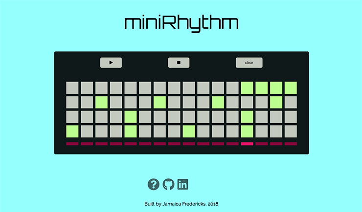

# [miniRhythm](http://www.jamaicafredericks.com/miniRhythm/)

## Background

Step sequencers are musical instruments that play rhythmic patterns. Users select the sounds they wish to play, and layer these sounds together within a short repeating interval. Sequencers have been a mainstay in electronic and computer music since the mid-twentieth century. [miniRhythm](http://www.jamaicafredericks.com/miniRhythm/) is inspired by classic late-twentieth century drum machines.

## Functionality

The app incorporates key elements of a step sequencer:

  - Step buttons control musical timing and duration
  - The sequencer triggers a sound source
  - A control surface enables users to further modify audio output

  

When playing the instrument, users primarily interact with a matrix of step buttons. Each matrix row corresponds to a different percussive sound and each column represents a 1/16 of a musical measure. Along the bottom of the step button matrix, is a sequencer display indicating playback timing. Users can play, pause, and clear step sequencer playback.

## Architecture and Technologies

The app consists of a single page featuring all user controls, a link to toggle an instructional modal, and links to the GitHub repository.

The project was implemented with the following technologies:
  - JavaScript for handling fundamental app logic
  - [Tone.js](https://tonejs.github.io/) framework for web audio implementation
  - [Audacity](https://www.audacityteam.org/) audio editing software to normalize and compress .mp3 samples
  - CSS, HTML5, and Canvas for visualization
  - Webpack to bundle .js files

In addition to the entry file, project scripts include:

`player.js` where audio samples are triggered via the `Tone.Players` class. `Tone.Sequence` controls loop sequence scheduling through an event callback and internal clock.
All samples were sourced from [freesound.org](https://freesound.org/).

`data.js` manages the current playback and sequencer state. Playback mode is stored as an array of 'channel' objects.

`controlSurface.js` and `sequence.js` contain logic for rendering the instrument graphic user interface and display.

## Future Improvements

- Add greater control surface functionality: volume levels, tempo, and swing
- Include volume level controls for each individual audio element
- Increase number of audio sounds and audio effects (reverb, delay, panning) for greater playback variety
